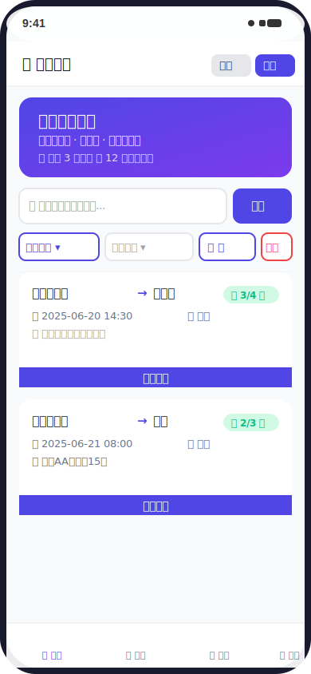
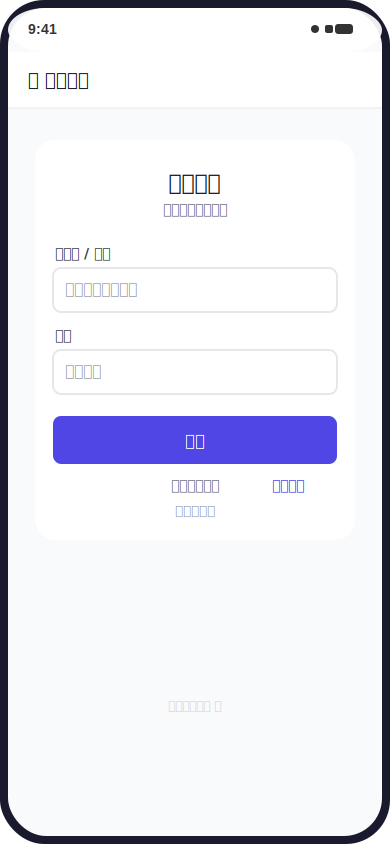
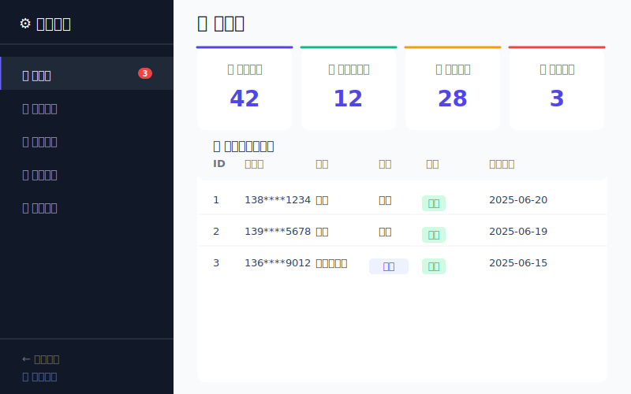

<p align="center">
  <br>
  
  
  
  
  <br>
</p>

<div align="center">

# 🚗 校区拼车平台

**校园通勤拼车信息共享平台 · 让出行更简单**

[功能特性](#-功能特性) •
[页面预览](#-页面预览) •
[快速开始](#-快速开始) •
[项目结构](#-项目结构) •
[安全设计](#-安全设计) •
[常见问题](#-常见问题)

</div>

---

## 📋 项目简介

校区拼车平台是一个面向高校师生的拼车信息共享平台。学生可以发布从校区到火车站、机场等目的地的拼车信息，也可以预订他人的拼车，实现校园通勤的资源共享。

### 🎯 解决的问题

| 问题 | 说明 |
|------|------|
| 🚶 **出行不便** | 校区分散，公共交通耗时长，打车成本高 |
| 💺 **资源浪费** | 私家车空跑率高，座位大量闲置 |
| 📱 **信息分散** | 拼车信息散落在微信群/QQ群，难以查找和管理 |

---

## ✨ 功能特性

### 👤 用户端

| 功能 | 说明 |
|------|------|
| 📱 注册/登录 | 支持手机号+邮箱双凭据登录 |
| 🚗 发布拼车 | 填写路线、时间、座位数，一键发布 |
| 📌 预订拼车 | 一键预订，座位数实时更新 |
| 🔒 隐私保护 | 预订成功后才可查看联系方式 |
| 🔔 通知中心 | 站内通知 + 邮件通知（预订/取消/满员） |
| 👤 个人中心 | 资料编辑、密码修改、通知管理 |

### ⚙️ 管理端

| 功能 | 说明 |
|------|------|
| 📊 仪表盘 | 用户数、拼车数、预订数一目了然 |
| 👥 用户管理 | 查看/禁用/启用用户 |
| 🚗 拼车管理 | 浏览全部拼车记录 |
| 📌 预订管理 | 查看全部预订流水 |
| 🔧 系统配置 | 站点名称、注册验证、通知开关 |

---

## 📱 页面预览

<div align="center">
  <table>
    <tr>
      <td align="center" width="33%">
        <br>
        <sub><b>🏠 首页</b> — 拼车列表、搜索筛选</sub>
      </td>
      <td align="center" width="33%">
        <br>
        <sub><b>🔑 登录页</b> — 手机号/邮箱登录</sub>
      </td>
      <td align="center" width="33%">
        <br>
        <sub><b>⚙️ 管理后台</b> — 数据仪表盘</sub>
      </td>
    </tr>
  </table>
</div>

---

## 🚀 快速开始

### 环境要求

| 项目 | 要求 |
|------|------|
| Web 服务器 | Nginx 1.18+ / Apache 2.4+ |
| PHP | **7.4** 或 **8.0 / 8.1**（推荐 8.1） |
| 数据库 | MySQL 5.7+ / MariaDB 10.3+ |
| PHP 扩展 | `pdo_mysql`、`openssl`、`mbstring` |

### 安装步骤

```bash
# 1. 克隆项目
git clone https://github.com/your-username/carpool-campus.git
cd carpool-campus

# 2. 创建本地配置（敏感信息单独存放，不会被 Git 追踪）
cp config.local.example.php config.local.php
```

<details>
<summary><b>📝 编辑 config.local.php 填入你的配置</b></summary>

```php
// ===== 数据库配置 =====
define('DB_NAME', 'your_database_name');        // 数据库名
define('DB_USER', 'your_database_user');        // 数据库用户名
define('DB_PASS', 'your_database_password');    // 数据库密码

// ===== 邮件配置 (SMTP) =====
define('MAIL_HOST', 'smtp.office365.com');      // SMTP 服务器
define('MAIL_PORT', 587);                        // 端口
define('MAIL_USERNAME', 'your@email.com');       // 邮箱地址
define('MAIL_PASSWORD', 'your_app_password');    // SMTP 授权码/应用密码
```

> 🔑 **邮件配置说明**：推荐使用 Outlook 邮箱的「应用密码」。QQ邮箱/163邮箱需使用「授权码」。验证码邮件依赖此配置，如暂不需要可留空。
</details>

```bash
# 3. 导入数据库结构（自动建表并插入默认管理员）
mysql -u root -p your_database_name < setup.sql

# 4. 配置 Web 服务器根目录指向项目文件夹
#    访问 http://your-domain.com 即可开始使用
```

### ⚡ 快速体验

部署完成后，使用默认管理员账号登录后台：

| 角色 | 邮箱 | 密码 |
|------|------|------|
| 🔑 超级管理员 | `admin@example.com` | `admin123456` |

> ⚠️ **安全提醒**：部署后请**立即登录后台修改管理员邮箱和密码**。

---

## 📁 项目结构

```
carpool-campus/
├── admin/                       # 后台管理模块
│   ├── index.php                # 📊 仪表盘
│   ├── users.php                # 👥 用户管理
│   ├── rides.php                # 🚗 拼车管理
│   ├── bookings.php             # 📌 预订管理
│   └── config.php               # 🔧 系统配置
│
├── api/                         # API 接口
│   └── send_code.php            # 验证码发送接口
│
├── assets/                      # 静态资源
│   ├── css/app.css              # 主样式表（移动优先）
│   └── js/app.js                # 前端交互脚本
│
├── screenshots/                 # 页面预览截图
│   ├── home.svg                 # 首页设计图
│   ├── login.svg                # 登录页设计图
│   └── admin.svg                # 管理后台设计图
│
├── config.php                   # 主配置文件
├── config.local.example.php     # 🌟 本地配置模板（部署时复制此文件）
├── config.local.php             # ❌ 本地敏感配置（已加入 .gitignore）
├── functions.php                # 工具函数库
├── header.php                   # 公共头部模板
├── footer.php                   # 公共底部模板
│
├── index.php                    # 🏠 首页（拼车列表+搜索）
├── login.php                    # 🔑 登录
├── register.php                 # 📝 注册
├── logout.php                   # 🚪 退出登录
├── forgot_password.php          # 🔄 找回密码
│
├── post_ride.php                # 🚗 发布拼车
├── book_ride.php                # 📌 预订拼车
├── cancel_booking.php           # ↩️ 取消预订
├── delete_ride.php              # 🗑️ 删除拼车
│
├── my_rides.php                 # 📋 我的发布
├── my_bookings.php              # 📋 我的预订
├── user_center.php              # 👤 个人中心
│
├── setup.sql                    # 🗄️ 数据库初始化脚本
├── migrate_v2.sql               # 🔼 数据库迁移 v2
├── migrate_v3.sql               # 🔼 数据库迁移 v3
├── migrate_v4.sql               # 🔼 数据库迁移 v4
│
├── 404.html                     # 404 页面
├── .gitignore                   # Git 忽略规则
└── README.md                    # 📖 本文件
```

---

## 🔒 安全设计

### 防护措施

```
✅ 密码加密          → 使用 bcrypt（cost=10）哈希存储
✅ CSRF 防护         → 所有表单带 Token 验证
✅ SQL 注入防护      → 全量使用参数化 PDO 查询
✅ XSS 防护          → htmlspecialchars 输出转义
✅ 频率限制          → 登录/注册/验证码均有 IP 级别限流
✅ 会话安全          → 登录后重新生成 session_id
✅ 权限校验          → 后台页面强制管理员身份验证
✅ 日志审计          → 管理员所有关键操作记录日志
```

### 敏感信息管理

```
config.local.php    ← ❌ 不上传 Git（真实数据库密码/邮箱密钥）
config.php          ← ✅ 上传 Git（通用框架配置，不含敏感信息）
```

---

## 📧 邮件通知

平台在以下场景会自动发送邮件通知（需配置 SMTP）：

| 场景 | 通知对象 | 说明 |
|------|---------|------|
| ✅ 预订成功 | 乘客 + 发布者 | 双方确认行程 |
| ❌ 取消预订 | 乘客 + 发布者 | 座位自动释放 |
| 🚗 拼车满员 | 发布者 + 所有乘客 | 可确认行程 |
| 🚫 拼车取消 | 发布者 + 所有乘客 | 行程终止通知 |
| 🔢 验证码 | 注册/找回密码用户 | 身份验证 |

> 可在后台管理系统「系统配置」中开关邮件通知功能。

---

## ❓ 常见问题

<details>
<summary><b>验证码收不到邮件？</b></summary>

1. 检查垃圾邮件箱
2. 确认 SMTP 配置已保存（后台 → 系统配置）
3. 确认使用的是 **应用密码/授权码** 而非登录密码
4. 检查服务器防火墙是否允许 SMTP 端口的**出站**连接
5. 查看 PHP 错误日志定位问题
</details>

<details>
<summary><b>忘记管理员密码怎么办？</b></summary>

SSH 登录服务器后直接通过 MySQL 重置：
```sql
-- 先用 PHP 生成新密码的 bcrypt 哈希
php -r "echo password_hash('新密码', PASSWORD_BCRYPT);"

-- 然后单条 SQL 更新
UPDATE users SET password_hash = '生成的哈希值' WHERE email = 'admin@example.com';
```
</details>

<details>
<summary><b>页面显示 500 错误？</b></summary>

1. 查看 PHP 错误日志
2. 确认 `config.local.php` 中的数据库连接信息正确
3. 确认数据库已成功导入 `setup.sql`
4. 检查 PHP 是否已启用 `pdo_mysql` 扩展
</details>

<details>
<summary><b>推荐使用什么 Web 服务器？</b></summary>

推荐 Nginx，性能更高。Nginx 伪静态配置示例：
```nginx
location / {
    if (!-e $request_filename) {
        rewrite ^(.*)$ /index.php?s=$1 last;
        break;
    }
}
```
</details>

---

## 📄 许可证

[MIT](LICENSE)

---

<p align="center">
  用 ❤️ 为校园出行而建
</p>
